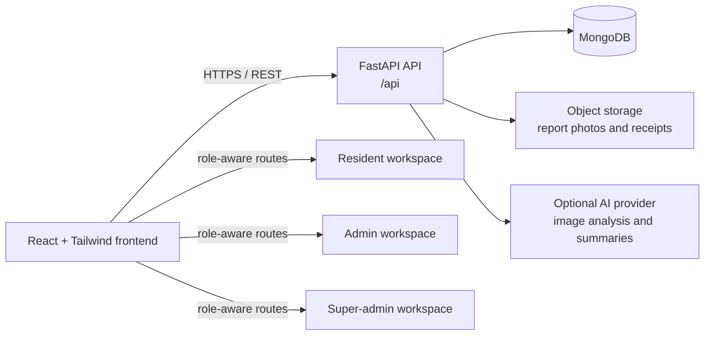

# NUSA-AI

> **NUSA — AI Community Operating System** is a mobile-first web application for Indonesian RT/RW communities. It brings together resident reports, neighbourhood finances, announcements, activities, and AI-assisted community insights in one role-based workspace.

NUSA-AI supports three user roles: **residents** report local issues and follow their status; **community administrators** triage reports, manage finances, publish community updates, and review analytics; and **super administrators** monitor platform-level activity. The product interface uses Bahasa Indonesia microcopy and is designed to work well on mobile devices.

## Contents

- [Key capabilities](#key-capabilities)
- [Architecture](#architecture)
- [Technology stack](#technology-stack)
- [Repository layout](#repository-layout)
- [Prerequisites](#prerequisites)
- [Local development](#local-development)
- [Environment configuration](#environment-configuration)
- [Quality checks](#quality-checks)
- [Security and operational notes](#security-and-operational-notes)
- [Roadmap](#roadmap)
- [Reference documentation](#reference-documentation)

## Key capabilities

| Area | What NUSA-AI provides |
|---|---|
| **Resident portal** | Dashboard, issue submission with image upload, report-status history, finance visibility, announcements, activities, and profile management. |
| **Smart reporting** | Residents can attach a photo to a report. The application can use AI to suggest the category, severity, issue summary, and recommended action. |
| **Admin command centre** | Community administrators can manage reports, update their status, work with resident and household data, record transactions, upload receipt evidence, and publish announcements. |
| **Community insights** | Analytics for report categories, severity, monthly trends, per-RT performance, report hotspots, and the Community Pulse score. |
| **Financial transparency** | Income and expense records, balance calculations, charts, and receipt evidence visible according to each role’s permissions. |
| **Ask NUSA** | A conversational interface for questions about community information and operational data. |
| **Monthly report** | An AI-assisted community summary with a print-friendly view. |
| **Role-based access** | Separate resident, admin, and super-admin routes backed by JWT authentication. |

## Architecture



The browser application uses React Router for lazy-loaded public and protected routes. The API is mounted under `/api`, verifies the MongoDB connection and seeds demonstration data when required, and supports CORS configuration through environment variables.

## Technology stack

| Layer | Main technologies |
|---|---|
| Frontend | React 19, React Router, Tailwind CSS, CRACO, Axios, Recharts, Leaflet, and Radix-based UI components. [1] [2] |
| Backend | FastAPI, Motor/PyMongo async, Pydantic, JWT, and Uvicorn. [3] [4] |
| Data | MongoDB with collections for users, households, residents, reports, report analysis, finance transactions, announcements, activities, metrics, conversations, report events, and notifications. [5] |
| Authentication | JWT tokens with role checks for `resident`, `admin`, and `superadmin`. [6] |
| Storage and AI | Emergent integration proxy/object storage; optional external AI provider for vision analysis and textual summaries, with a deterministic mock fallback. |
| Testing | Pytest with `pytest-xdist` for backend checks; the frontend provides the standard Create React App test and production-build scripts. [7] |

## Repository layout

```text
NUSA-AI/
├── .emergent/              # Emergent runtime metadata and system dependencies
├── backend/
│   ├── server.py            # FastAPI application and API routes
│   ├── auth.py              # JWT creation, authentication, and role checks
│   ├── db.py                # Async MongoDB client, session adapter, and indexes
│   ├── models.py            # Database models
│   ├── ai_service.py        # AI provider integration and mock fallback
│   ├── analytics.py         # Community Pulse and reporting analytics
│   ├── storage.py           # Object-storage integration
│   ├── seed.py              # Demonstration data seeding
│   ├── requirements.txt     # Python dependencies
│   └── tests/               # Backend test suites
├── frontend/
│   ├── src/pages/           # Public, resident, admin, and super-admin pages
│   ├── src/components/      # Layouts, maps, timeline, Ask NUSA, shared UI
│   ├── src/context/         # Authentication and theme state
│   ├── src/lib/api.js       # Axios API client
│   ├── package.json         # Frontend scripts and dependencies
│   └── tailwind.config.js   # Tailwind configuration
├── design_guidelines.json   # Product design guidance
└── memory/PRD.md            # Product requirements and implementation history
```

## Prerequisites

Install the following before running NUSA-AI outside of its managed environment.

| Requirement | Suggested version | Purpose |
|---|---:|---|
| Node.js | 20 or later | Builds and runs the React frontend. |
| Yarn Classic | 1.22.x | Matches the package manager recorded in `frontend/package.json`. |
| Python | 3.11 or later | Runs the FastAPI backend. |
| MongoDB | 6 or later | Stores application data. |
| Git | Current stable release | Clones and manages the project source. |

## Local development

### 1. Clone the repository

```bash
git clone https://github.com/nialthony/NUSA-AI.git
cd NUSA-AI
```

### 2. Configure MongoDB

Run MongoDB locally or provision a managed MongoDB database. The backend connects through `MONGODB_URL` and uses `MONGODB_DB` as the database name. Existing PostgreSQL data should be exported and transformed before production cutover; the application seeder only creates demonstration data when the MongoDB collections are empty.

### 3. Configure and run the backend

Create `backend/.env` using the template in [Environment configuration](#environment-configuration), then install dependencies and launch the API.

```bash
cd backend
python -m venv .venv
source .venv/bin/activate              # Windows PowerShell: .venv\Scripts\Activate.ps1
pip install -r requirements.txt
uvicorn server:app --reload --host 0.0.0.0 --port 8000
```

The API is available at `http://localhost:8000`, with application endpoints under `http://localhost:8000/api`.

### 4. Configure and run the frontend

In a separate terminal, create `frontend/.env` and point it to the backend.

```dotenv
REACT_APP_BACKEND_URL=http://localhost:8000
```

Then install dependencies and start the React development server.

```bash
cd frontend
yarn install
yarn start
```

Open `http://localhost:3000` in a browser. The frontend uses `REACT_APP_BACKEND_URL` to construct its `/api` base URL.

## Environment configuration

Never commit `.env` files or live secrets. Use unique local values for development and managed secret storage in deployed environments.

### Backend: `backend/.env`

```dotenv
# Required
MONGODB_URL=mongodb://localhost:27017
MONGODB_DB=nusa_ai
JWT_SECRET=replace-with-a-long-random-development-secret

# Development CORS; restrict to real origins in deployed environments
CORS_ORIGINS=http://localhost:3000

# Optional: AI. The app remains usable with AI_PROVIDER=mock.
AI_PROVIDER=mock
# AI_PROVIDER=external
# EMERGENT_LLM_KEY=replace-with-managed-secret
# LLM_PROVIDER=gemini
# LLM_MODEL=gemini-3-flash-preview

# Optional: only changes the seeded demonstration password
# DEMO_PASSWORD=change-me

# Optional: set by the managed platform when object storage is used
# INTEGRATION_PROXY_URL=https://your-integration-proxy.example
```

| Variable | Required | Description |
|---|---:|---|
| `MONGODB_URL` | Yes | MongoDB connection string consumed by Motor. |
| `MONGODB_DB` | No | MongoDB database name; defaults to `nusa_ai`. |
| `JWT_SECRET` | Yes | Secret used to sign and verify access tokens. Generate a long random value for every environment. |
| `CORS_ORIGINS` | Recommended | Comma-separated browser origins allowed to call the API. Defaults to `*` in code; use explicit values outside development. |
| `AI_PROVIDER` | No | Use `mock` for deterministic local responses or `external` to enable an external AI provider. |
| `EMERGENT_LLM_KEY` | Conditional | Required only when `AI_PROVIDER=external`. Store this only in managed secrets. |
| `LLM_PROVIDER` / `LLM_MODEL` | No | Optional external AI provider and model overrides. |
| `DEMO_PASSWORD` | No | Overrides the password used for seeded demo accounts. |
| `INTEGRATION_PROXY_URL` | No | Optional managed integration and object-storage proxy endpoint. |

### Frontend: `frontend/.env`

```dotenv
REACT_APP_BACKEND_URL=http://localhost:8000
```

## Quality checks

Run the following checks before creating a pull request.

| Check | Command | Notes |
|---|---|---|
| Build frontend | `cd frontend && yarn build` | Produces the optimized React bundle in `frontend/build`. |
| Run frontend tests | `cd frontend && yarn test` | Starts the configured Create React App test runner. |
| Run backend tests | `cd backend && pytest` | Uses the repository’s configured `pytest-xdist` options. Set `REACT_APP_BACKEND_URL` when the tests should target a non-default backend URL. |
| Inspect API manually | Visit `http://localhost:8000/docs` | FastAPI exposes interactive API documentation while the development server is running. [3] |

## Security and operational notes

- **Do not use default or demonstration credentials in a deployed environment.** Set a strong `JWT_SECRET`, replace seeded test users, and restrict database access.
- **Protect uploaded files.** Report images and financial receipts can contain personal or sensitive community information. Apply appropriate access controls and retention policies to the storage layer.
- **Restrict CORS in production.** Replace development origins with the exact deployed frontend domain or domains.
- **Use least-privilege AI and storage credentials.** Keep `EMERGENT_LLM_KEY` and platform keys outside the repository.
- **Review AI output before acting on it.** Report categorisation, severity, summaries, and recommendations are decision-support features; community administrators remain responsible for final decisions.

## Roadmap

The current product backlog identifies the following near-term improvements:

1. Report assignment to community staff and SLA tracking.
2. A detailed report page with richer follow-up context.
3. Finance-ledger exports in CSV and Excel formats.
4. Resident registration and household self-service.
5. Notification delivery integrations, including WhatsApp after a provider is selected and credentials are configured.
6. Longer-term work including multi-community onboarding, server-side PDF export, offline-first PWA support, activity RSVP records, streamed AI responses, and notification pagination.

## Contributing

Use a focused branch for each change and keep user-facing copy in Bahasa Indonesia unless the design direction intentionally changes. Before opening a pull request, run the relevant build and test commands, describe any data or environment-variable changes, and include screenshots for UI updates where possible.

## Reference documentation

[1]: https://react.dev/ "React documentation"
[2]: https://tailwindcss.com/docs "Tailwind CSS documentation"
[3]: https://fastapi.tiangolo.com/ "FastAPI documentation"
[4]: https://motor.readthedocs.io/ "Motor documentation"
[5]: https://www.mongodb.com/docs/ "MongoDB documentation"
[6]: https://jwt.io/introduction "JSON Web Token introduction"
[7]: https://docs.pytest.org/ "pytest documentation"
